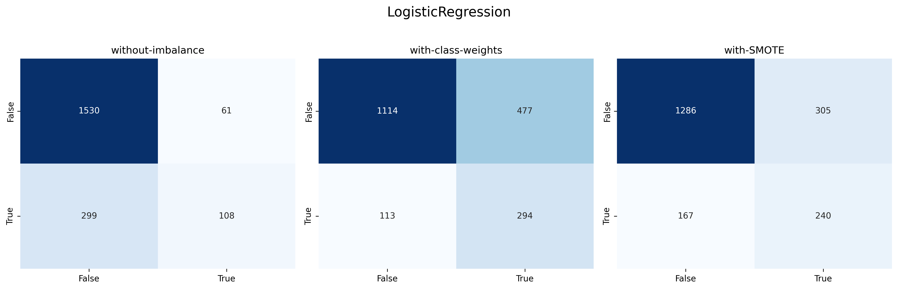

# Abdellah LAMBARAA

Étudiant à l’ENSET Mohammedia, je travaille sur des projets Data & MLOps orientés industrialisation des modèles de machine learning.

Ce dépôt présente mon TP4 en MLOps, consacré à la détection du churn client avec une approche complète : préparation des données, entraînement, suivi des performances, versioning et automatisation CI/CD.

## À propos de ce projet

Le projet entraîne un modèle de classification binaire du churn en comparant trois stratégies de gestion du déséquilibre des classes :
- entraînement standard,
- entraînement avec pondération des classes (`class_weight`),
- entraînement avec sur-échantillonnage (`SMOTE`).

L’objectif est de produire un pipeline reproductible, traçable et prêt à être exécuté automatiquement via GitHub Actions.

## Stack technique

- Python (pandas, scikit-learn, imbalanced-learn, matplotlib, seaborn)
- DVC pour la reproductibilité et le suivi des sorties
- CML + GitHub Actions pour l’automatisation des runs et du reporting

## Exécution locale

```bash
python -m pip install -r requirements.txt
python script.py
```

## Sorties générées

- `metrics.txt` : scores d’évaluation des différentes stratégies
- `conf_matrix.png` : visualisation consolidée des matrices de confusion
- `models/` : modèles entraînés et sérialisés

## Capture d’écran



## Automatisation CI/CD

Le workflow GitHub Actions (`.github/workflows/cml-churn.yaml`) :
- installe les dépendances,
- exécute `dvc repro` (ou `python script.py` en fallback),
- génère un rapport CML,
- publie les artefacts du run.

## Configuration des secrets (optionnel)

Le pipeline peut utiliser un remote DVC selon deux modes :

- **S3** : `DVC_S3_BUCKET`, `AWS_ACCESS_KEY_ID`, `AWS_SECRET_ACCESS_KEY`
  - optionnels : `DVC_S3_REGION`, `DVC_S3_ENDPOINTURL`, `AWS_SESSION_TOKEN`
- **Google Drive** : `DVC_GDRIVE_FOLDER_ID`
  - recommandé : `DVC_GDRIVE_SERVICE_ACCOUNT_JSON`

## Contact

**Abdellah LAMBARAA**  
Étudiant — ENSET Mohammedia
